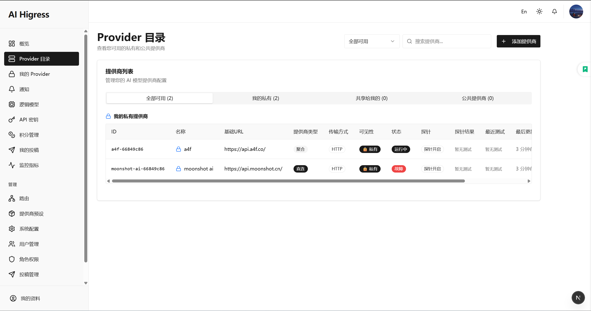

<p align="center">
  
</p>

<div align="center">

[](https://github.com/MarshallEriksen-Neura/AI-Higress-Gateway/releases)
[](https://github.com/MarshallEriksen-Neura/AI-Higress-Gateway/actions)
[](https://github.com/MarshallEriksen-Neura/AI-Higress-Gateway/blob/main/LICENSE)
[](https://github.com/MarshallEriksen-Neura/AI-Higress-Gateway/stargazers)

</div>

<h1 align="center">AI-Higress-Gateway</h1>

<p align="center"><em>Production-grade AI gateway: OpenAI-compatible API, multi-provider routing, front/back dashboards, caching, and failover.</em></p>

[English](#english-overview) · [中文](#中文概览)

---

## English Overview

### 🌟 Highlights
- 🔀 Multi-provider routing with weighted scheduling, health checks, and failover.
- 🧭 OpenAI-compatible surface (`/v1/chat/completions`, `/v1/responses`, `/models`) with request adapters.
- 🧠 Session stickiness via `X-Session-Id`, Redis-backed context and model caches.
- 💳 Credits & billing hooks: per-user/provider request accounting, quotas, and history.
- 📊 Metrics and dashboards: provider ranking, success rate trends, request history, user-scoped overview.
- 🛡️ AuthN/Z + API key issuance, roles/permissions, security middleware, rate-limit, input validation.
- 🧰 Dev UX: FastAPI backend + Next.js (App Router) admin UI, docker-compose one-click stack.

<p align="center">
  
</p>

### 📸 Screenshots

<p align="center">
  
</p>

<p align="center">
  
</p>

### 🧩 Feature Matrix
- Gateway & API: OpenAI-compatible chat/responses/models; SSE & non-streaming; context store.
- Providers: public & private provider registration, provider presets, logical models, weighted routing, submission & approval flow.
- Routing & control: routing rules, failover/backoff, health metrics, cache invalidation.
- Identity & access: JWT login, API keys, role/permission management, user profile & avatar.
- Credits & billing: credit balance and transaction history, per-user/provider metrics.
- Observability: user/provider metrics, success-rate trends, request history, audit-friendly session snippets.
- Admin & ops: system config, notifications, provider review, gateway status checks.

### 🚀 Quickstart (Backend)
1) Clone & enter:
```bash
git clone https://github.com/MarshallEriksen-Neura/AI-Higress-Gateway.git
cd AI-Higress-Gateway
```
2) Python 3.12 env:
```bash
python -m venv .venv
source .venv/bin/activate
pip install -e backend/
```
3) Start Redis (dev):
```bash
docker-compose up -d
```
4) Run API gateway (dev):
```bash
cd backend
apiproxy  # or: uvicorn main:app --reload
```

### 🖥️ Quickstart (Frontend)
```bash
cd frontend
bun install   # or pnpm / npm
bun dev       # starts Next.js dashboard
```
Env (frontend) is in `frontend/.env.example` (`NEXT_PUBLIC_API_BASE_URL` → backend URL).

### ⚙️ Configuration
- Main settings in `backend/app/settings.py`; prefer env vars.
- Generate `SECRET_KEY` via system API `POST /system/secret-key/generate` and put into `.env`.
- Redis/PostgreSQL URLs are read from `.env`; see sample values in the repo.
- Optional: Celery broker/result can reuse Redis; see `.env` sample keys.
- Example env keys:
  - `REDIS_URL`, `REDIS_PASSWORD`
  - `DATABASE_URL` (postgresql+psycopg)
  - `SECRET_KEY`
  - `LOG_LEVEL` (default INFO)
  - `ENABLE_AUTO_MIGRATION` (optional dev auto-upgrade)

### 🧪 Testing (backend)
We use `pytest` and `pytest-asyncio`. Run locally (AI agent will not run tests for you):
```bash
cd backend
pytest
```

### 🐳 Docker Compose
```bash
docker-compose up -d  # backend + redis
```
Adjust volumes/ports in `docker-compose.yml` for production; run `alembic upgrade head` in CI before rollout.

### 🗺️ API Surface (high-level)
- OpenAI-compatible gateway: `/v1/chat/completions`, `/v1/responses`, `/models`.
- Management & ops: providers, logical models, routing rules, sessions, metrics, credits, auth, notifications, users & roles, API keys, private provider submissions, gateway/system config.

### 📂 Project Layout
- `backend/`: FastAPI gateway (`main.py` entrypoint, core logic in `app/`).
- `frontend/`: Next.js dashboard (App Router + Tailwind + shadcn/ui).
- `docs/`: Design/API notes; keep API behavior in sync (`docs/api/`).
- `scripts/`: Helper scripts (model listing, key ops, etc.).
- `tests/`: Pytest suite (sync + async).
- `docker-compose.yml`: Local stack (includes Redis).

### 📚 Documentation
- API docs: `docs/api/`
- Backend design: `docs/backend/`
- Frontend design: `docs/fronted/`
- Screenshots/assets: `docs/images/`

### 🧱 Tech Stack & Deps
- Python 3.12, FastAPI, SQLAlchemy, PostgreSQL, Redis (context/cache), Celery (optional async tasks).
- Frontend: Next.js (App Router), Tailwind CSS, shadcn/ui, SWR data layer.

### 🤝 Contributing
- Follow PEP 8, type hints, snake_case; keep commits focused.
- Add/update tests with new endpoints, caching rules, or context behaviors.
- Update `docs/api/` when changing API surface, auth, or error codes.
- Example commit style: `添加模型缓存错误处理`.

### 📜 License
MIT

---

## 中文概览

### 🌟 核心亮点
- 🔀 多提供商路由与权重调度，健康探测 + 故障切换。
- 🧭 OpenAI 兼容接口（`/v1/chat/completions`, `/v1/responses`, `/models`），内置请求适配器。
- 🧠 `X-Session-Id` 会话粘滞，Redis 承载上下文与模型缓存。
- 💳 积分与计费：用户/Provider 维度的请求计量、额度与交易历史。
- 📊 指标与看板：Provider 排行、成功率趋势、请求历史、用户维度概览。
- 🛡️ 一站式安全：鉴权、API Key 发行、角色/权限、中间件安全校验、限流。
- 🧰 研发友好：FastAPI 后端 + Next.js 管理台（App Router + Tailwind + shadcn/ui），docker-compose 一键本地栈。

<p align="center">
  
</p>

<p align="center">
  
</p>

### 🧩 功能矩阵
- 网关与 API：OpenAI 兼容（Chat/Responses/Models）、SSE/非流、上下文存储。
- Provider：公共/私有 Provider 注册，预设模板，逻辑模型映射，权重路由，提交与审核流程。
- 路由与控制：路由规则、故障切换/回退、健康探测、缓存失效。
- 身份与访问：JWT 登录、API Key、角色/权限、用户资料与头像。
- 积分与计费：余额/消耗/交易历史，用户 & Provider 维度指标。
- 可观测性：用户/Provider 指标、成功率趋势、请求历史、会话审计片段。
- 运维与管理：系统配置、通知、Provider 审核、网关健康检查。

### 🚀 快速开始（后端）
1) 克隆并进入目录：
```bash
git clone https://github.com/MarshallEriksen-Neura/AI-Higress-Gateway.git
cd AI-Higress-Gateway
```
2) 创建 Python 3.12 虚拟环境并安装：
```bash
python -m venv .venv
source .venv/bin/activate
pip install -e backend/
```
3) 启动 Redis（本地）：
```bash
docker-compose up -d
```
4) 开发模式运行网关：
```bash
cd backend
apiproxy  # 或 uvicorn main:app --reload
```

### 🖥️ 快速开始（前端）
```bash
cd frontend
bun install   # 或 pnpm / npm
bun dev       # 启动 Next.js 管理台
```
前端环境变量示例见 `frontend/.env.example`（`NEXT_PUBLIC_API_BASE_URL` 指向后端）。

### ⚙️ 配置要点
- 核心配置在 `backend/app/settings.py`，推荐使用环境变量。
- 通过系统 API `POST /system/secret-key/generate` 生成 `SECRET_KEY` 写入 `.env`，避免提交真实密钥。
- Redis/PostgreSQL 连接信息从 `.env` 读取，可按需调整。
- Celery 可复用 Redis 作为 broker/result（参考 `.env` 示例）。
- 常用环境变量：
  - `REDIS_URL`, `REDIS_PASSWORD`
  - `DATABASE_URL`（postgresql+psycopg）
  - `SECRET_KEY`
  - `LOG_LEVEL`（默认 INFO）
  - `ENABLE_AUTO_MIGRATION`（开发可选自动迁移）

### 🧪 测试（后端）
使用 `pytest` / `pytest-asyncio`：
```bash
cd backend
pytest
```
AI Agent 不会代跑测试，请本地执行并关注结果。

### 🐳 容器化
```bash
docker-compose up -d  # 启动后端 + Redis
```
生产发布建议在 CI 先执行 `alembic upgrade head`，并结合外部 Redis、监控与日志。

### 📂 仓库结构
- `backend/`：FastAPI 后端（入口 `main.py`，业务在 `app/`）。
- `frontend/`：Next.js 管理与监控 UI（App Router + Tailwind + shadcn/ui）。
- `docs/`：设计与 API 文档（修改接口时同步更新 `docs/api/`）。
- `scripts/`：脚本工具（模型检查、批量任务、密钥生成示例等）。
- `tests/`：pytest 测试套件（含异步用例）。
- `docker-compose.yml`：本地开发编排（含 Redis）。

### 📚 文档与规范
- API 文档：`docs/api/`
- 后端设计：`docs/backend/`
- 前端设计：`docs/fronted/`
- UI 视觉规范：`ui-prompt.md`
- 前端文案与 i18n：`frontend/lib/i18n/`
- 设计/截图资源：`docs/images/`

### 🤝 贡献指南
- 遵循 PEP 8 与类型注解；函数/变量 snake_case，类 PascalCase。
- 每次新增接口/缓存/上下文逻辑都应补测试。
- 涉及 API 行为、鉴权或错误码的改动需同步更新 `docs/api/`。
- 提交信息保持简洁，如 `添加模型缓存错误处理`。

### 📜 许可证
MIT
