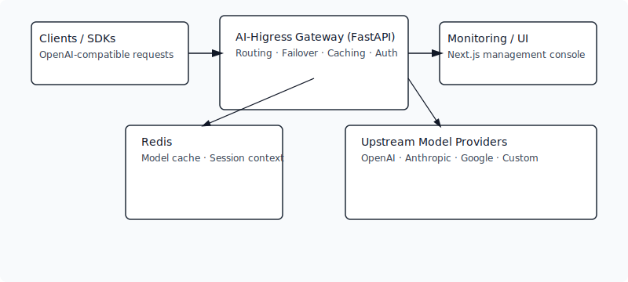
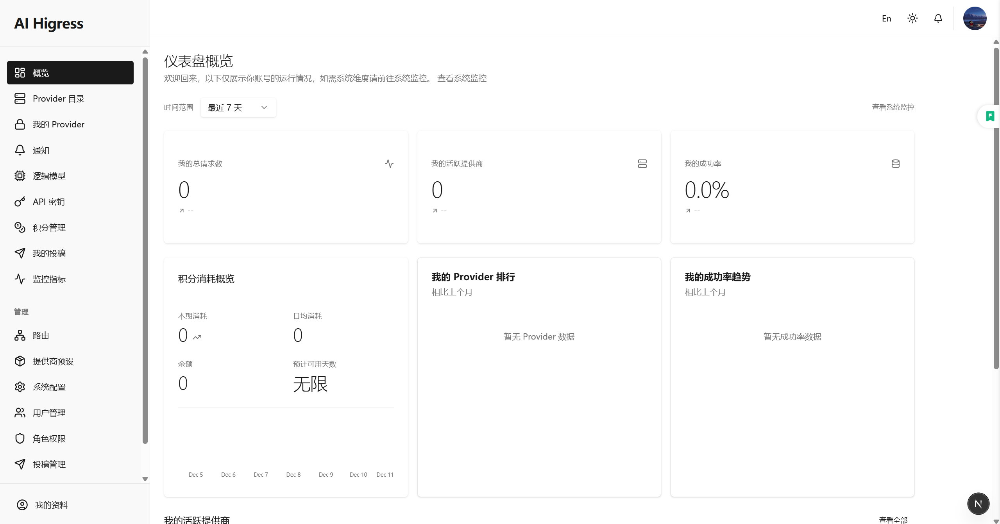

<p align="center">
  
</p>

<div align="center">

[](https://github.com/MarshallEriksen-Neura/AI-Higress-Gateway/releases)
[](https://github.com/MarshallEriksen-Neura/AI-Higress-Gateway/actions)
[](https://github.com/MarshallEriksen-Neura/AI-Higress-Gateway/blob/main/LICENSE)
[](https://github.com/MarshallEriksen-Neura/AI-Higress-Gateway/stargazers)

</div>

<h1 align="center">AI-Higress-Gateway</h1>

<p align="center"><em>面向生产的 AI 网关：OpenAI 兼容 API、多厂商路由、前后端看板、缓存与故障切换。</em></p>

[English README](README.md#english-overview)

---

## 🌟 核心亮点
- 🔀 多提供商路由与权重调度，健康探测 + 故障切换。
- 🧭 OpenAI 兼容接口（`/v1/chat/completions`, `/v1/responses`, `/models`），内置请求/响应适配器。
- 🧠 会话粘滞：`X-Session-Id` + Redis 保存上下文、模型缓存。
- 📊 指标与看板：Provider 排行、成功率趋势、请求历史、额度概览。
- 🛡️ 安全内置：鉴权、API Key 发行、角色/权限、中间件安全校验。
- 🧰 研发友好：FastAPI 后端 + Next.js 管理台（App Router + Tailwind + shadcn/ui），docker-compose 一键本地栈。

<p align="center">
  
</p>

## 📸 截图

<p align="center">
  
</p>

## 🚀 快速开始

### 后端
1) 克隆仓库：
```bash
git clone https://github.com/MarshallEriksen-Neura/AI-Higress-Gateway.git
cd AI-Higress-Gateway
```
2) Python 3.12 环境：
```bash
python -m venv .venv
source .venv/bin/activate
pip install -e backend/
```
3) 启动 Redis（本地）：
```bash
docker-compose up -d
```
4) 运行网关（开发模式）：
```bash
cd backend
apiproxy  # 或 uvicorn main:app --reload
```

### 前端
```bash
cd frontend
bun install   # 或 pnpm / npm
bun dev       # 启动 Next.js 管理台
```
前端环境变量示例：`frontend/.env.example`（`NEXT_PUBLIC_API_BASE_URL` 指向后端）。

## ⚙️ 配置
- 核心配置在 `backend/app/settings.py`，推荐使用环境变量。
- 通过系统 API `POST /system/secret-key/generate` 生成 `SECRET_KEY` 写入 `.env`。
- Redis/PostgreSQL 连接信息从 `.env` 读取，可按需调整端口/密码。

## 🧪 测试
后端使用 `pytest` / `pytest-asyncio`（AI Agent 不代跑，请本地执行）：
```bash
cd backend
pytest
```

## 🐳 容器化
```bash
docker-compose up -d  # 后端 + Redis
```
生产建议在 CI 先执行 `alembic upgrade head`，并结合外部 Redis、监控与日志。

## 📂 目录速览
- `backend/`：FastAPI 后端（入口 `main.py`，业务在 `app/`）。
- `frontend/`：Next.js 管理与监控 UI。
- `docs/`：设计与 API 文档（接口变更时同步更新 `docs/api/`）。
- `scripts/`：脚本工具（模型检查、批量任务、密钥生成示例等）。
- `tests/`：pytest 测试套件（含异步用例）。
- `docker-compose.yml`：本地开发编排（含 Redis）。

## 📚 文档与规范
- API 文档：`docs/api/`
- 后端设计：`docs/backend/`
- 前端设计：`docs/fronted/`
- UI 规范：`ui-prompt.md`
- 前端文案与 i18n：`frontend/lib/i18n/`

## 🤝 贡献指南
- 遵循 PEP 8、类型注解；函数/变量 snake_case，类 PascalCase。
- 新增接口/缓存/上下文逻辑需补充测试。
- 涉及 API 行为、鉴权或错误码的改动必须同步更新 `docs/api/`。
- 提交信息保持简洁，如 `添加模型缓存错误处理`。

## 📜 许可证
MIT
