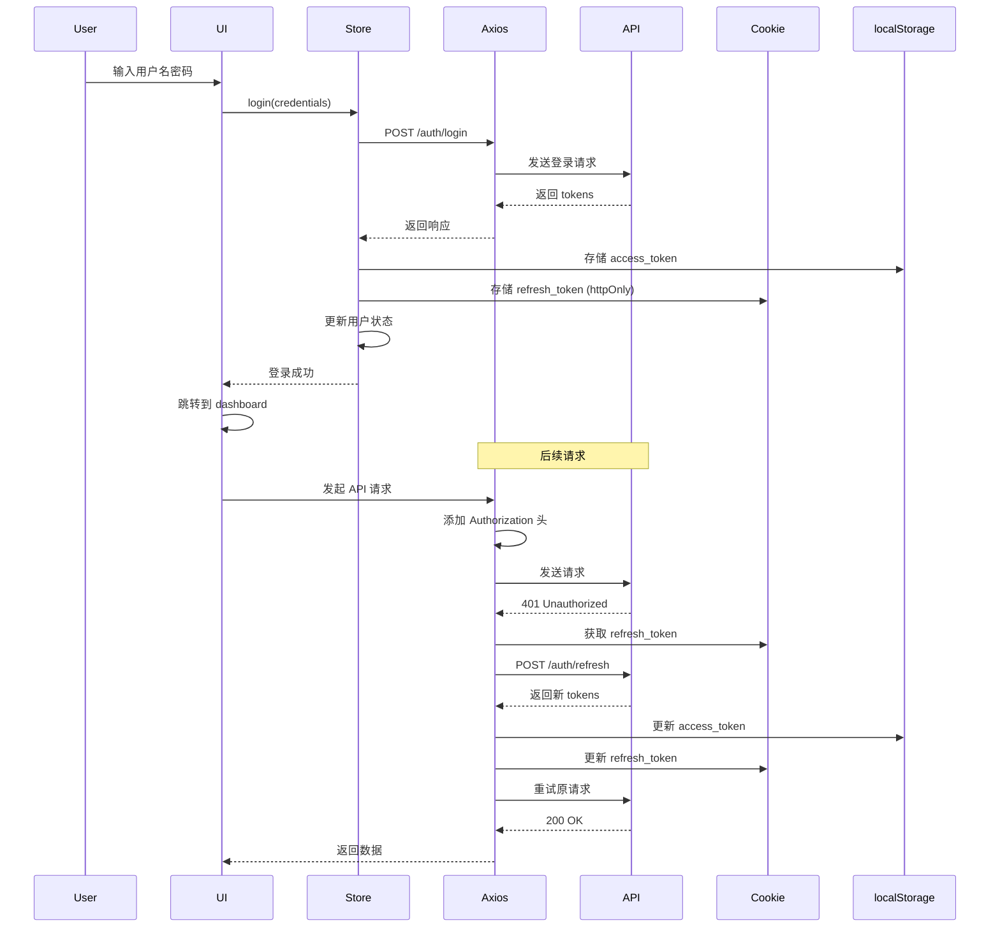

# 前端认证集成方案

## 概述

本文档详细说明如何将前端项目接入后端的登录和注册 API，实现完整的用户认证流程。

## 技术栈

- **状态管理**: Zustand（已安装）
- **HTTP 客户端**: Axios（已安装）
- **Cookie 管理**: js-cookie（需要安装）
- **表单验证**: React Hook Form + Zod（已安装）

## 架构设计

### 1. 认证状态管理（Zustand Store）

创建一个全局的认证状态管理 store，负责：
- 存储用户信息（内存中）
- 管理 access_token（localStorage）
- 管理 refresh_token（httpOnly cookie，通过 js-cookie）
- 提供登录、登出、刷新等方法

**文件位置**: `frontend/lib/stores/auth-store.ts`

```typescript
interface AuthState {
  user: UserInfo | null;
  isAuthenticated: boolean;
  isLoading: boolean;
  
  // Actions
  setUser: (user: UserInfo | null) => void;
  login: (credentials: LoginRequest) => Promise<void>;
  register: (data: RegisterRequest) => Promise<void>;
  logout: () => Promise<void>;
  refreshAuth: () => Promise<void>;
  checkAuth: () => Promise<void>;
}
```

### 2. Token 管理策略

#### Access Token
- **存储位置**: localStorage
- **用途**: 每次 API 请求的认证
- **过期时间**: 1小时（3600秒）
- **刷新策略**: 401 错误时自动刷新

#### Refresh Token
- **存储位置**: httpOnly cookie（通过 js-cookie 设置）
- **用途**: 获取新的 access_token
- **过期时间**: 7天（由后端设置）
- **安全性**: httpOnly 防止 XSS 攻击

### 3. Axios 拦截器增强

#### 请求拦截器
- 自动添加 `Authorization: Bearer {access_token}` 头
- 支持 API Key 认证（已实现）

#### 响应拦截器
- **401 错误处理**:
  1. 检测到 401 错误
  2. 尝试使用 refresh_token 刷新
  3. 刷新成功：重试原请求
  4. 刷新失败：清除认证信息，跳转登录页
- **其他错误**: 统一错误提示（已实现）

**关键实现**: 防止多个请求同时触发刷新（使用 Promise 队列）

### 4. 组件集成

#### AuthDialog 组件更新
- 连接 Zustand store 的 login/register 方法
- 添加表单验证（React Hook Form + Zod）
- 显示加载状态和错误信息
- 登录/注册成功后跳转到 dashboard

#### 受保护路由
创建 `withAuth` HOC 或使用 Next.js middleware：
- 检查用户认证状态
- 未认证用户重定向到登录页
- 已认证用户允许访问

#### 用户菜单组件
在顶部导航栏添加用户信息显示：
- 显示用户头像和名称
- 下拉菜单：个人资料、设置、登出

## 实施步骤

### 步骤 1: 安装依赖

```bash
cd frontend
bun add js-cookie
bun add -D @types/js-cookie
```

### 步骤 2: 创建 Zustand Auth Store

**文件**: `frontend/lib/stores/auth-store.ts`

核心功能：
- `login()`: 调用登录 API，存储 tokens 和用户信息
- `register()`: 调用注册 API，自动登录
- `logout()`: 清除所有认证信息
- `refreshAuth()`: 刷新 access_token
- `checkAuth()`: 页面加载时检查认证状态

### 步骤 3: 更新 Axios Client

**文件**: `frontend/http/client.ts`

增强功能：
1. 添加刷新 token 的逻辑
2. 实现请求队列，防止并发刷新
3. 401 错误时自动重试

```typescript
// 伪代码示例
let isRefreshing = false;
let failedQueue: Array<{resolve: Function, reject: Function}> = [];

// 在响应拦截器中
if (status === 401 && !originalRequest._retry) {
  if (isRefreshing) {
    // 将请求加入队列
    return new Promise((resolve, reject) => {
      failedQueue.push({resolve, reject});
    });
  }
  
  originalRequest._retry = true;
  isRefreshing = true;
  
  // 尝试刷新 token
  return refreshToken()
    .then(newToken => {
      // 更新 token 并重试所有队列中的请求
      processQueue(null, newToken);
      return instance(originalRequest);
    })
    .catch(err => {
      processQueue(err, null);
      // 跳转登录页
    })
    .finally(() => {
      isRefreshing = false;
    });
}
```

### 步骤 4: 更新 AuthDialog 组件

**文件**: `frontend/components/auth/auth-dialog.tsx`

改进：
1. 使用 React Hook Form 管理表单
2. 添加 Zod schema 验证
3. 连接 Zustand store
4. 显示加载和错误状态
5. 成功后跳转

```typescript
// 表单验证 schema
const loginSchema = z.object({
  username: z.string().min(3, "用户名至少3个字符"),
  password: z.string().min(6, "密码至少6个字符"),
});

const registerSchema = z.object({
  username: z.string().min(3).max(50),
  email: z.string().email("请输入有效的邮箱"),
  password: z.string().min(6).max(128),
  display_name: z.string().optional(),
});
```

### 步骤 5: 创建受保护路由 HOC

**文件**: `frontend/lib/auth/with-auth.tsx`

```typescript
export function withAuth<P extends object>(
  Component: React.ComponentType<P>
) {
  return function AuthenticatedComponent(props: P) {
    const { isAuthenticated, isLoading, checkAuth } = useAuthStore();
    const router = useRouter();
    
    useEffect(() => {
      checkAuth();
    }, []);
    
    useEffect(() => {
      if (!isLoading && !isAuthenticated) {
        router.push('/login');
      }
    }, [isAuthenticated, isLoading]);
    
    if (isLoading) return <LoadingSpinner />;
    if (!isAuthenticated) return null;
    
    return <Component {...props} />;
  };
}
```

### 步骤 6: 创建用户菜单组件

**文件**: `frontend/components/layout/user-menu.tsx`

功能：
- 显示用户头像和名称
- 下拉菜单：个人资料、设置、登出
- 使用 Zustand store 获取用户信息

### 步骤 7: 更新顶部导航栏

**文件**: `frontend/components/layout/top-nav.tsx`

添加：
- 未登录：显示"登录"按钮
- 已登录：显示用户菜单

### 步骤 8: 更新受保护页面

为需要认证的页面添加保护：
- `frontend/app/dashboard/*`
- `frontend/app/profile/*`
- `frontend/app/system/*`

使用方式：
```typescript
export default withAuth(DashboardPage);
```

## 数据流图



## 安全考虑

### 1. XSS 防护
- Refresh token 存储在 httpOnly cookie 中
- Access token 存储在 localStorage（短期有效）
- 所有用户输入都经过验证和转义

### 2. CSRF 防护
- 使用 SameSite cookie 属性
- API 使用 Bearer token 认证（不依赖 cookie）

### 3. Token 过期处理
- Access token 短期有效（1小时）
- Refresh token 长期有效（7天）
- 自动刷新机制减少用户中断

### 4. 敏感信息保护
- 密码不在前端存储
- 用户信息仅在内存中（Zustand store）
- 登出时清除所有认证信息

## 错误处理

### 登录失败
- 显示具体错误信息（用户名或密码错误）
- 账户被禁用提示

### 注册失败
- 用户名已存在
- 邮箱已被使用
- 密码强度不足

### Token 刷新失败
- 清除所有认证信息
- 跳转到登录页
- 显示"会话已过期，请重新登录"

### 网络错误
- 显示友好的错误提示
- 提供重试选项

## 测试计划

### 单元测试
- [ ] Auth store 的各个方法
- [ ] Axios 拦截器逻辑
- [ ] 表单验证 schema

### 集成测试
- [ ] 完整的登录流程
- [ ] 完整的注册流程
- [ ] Token 自动刷新
- [ ] 登出流程

### E2E 测试
- [ ] 用户注册 → 登录 → 访问受保护页面 → 登出
- [ ] Token 过期后自动刷新
- [ ] 多标签页同步登录状态

## 性能优化

1. **懒加载**: 认证相关组件按需加载
2. **缓存**: 用户信息缓存在 Zustand store
3. **防抖**: 登录/注册按钮防止重复提交
4. **预加载**: 登录成功后预加载 dashboard 数据

## 兼容性

- **浏览器**: Chrome 90+, Firefox 88+, Safari 14+, Edge 90+
- **移动端**: iOS Safari 14+, Chrome Mobile 90+
- **SSR**: 支持 Next.js 服务端渲染

## 后续优化

1. **记住我功能**: 延长 refresh token 有效期
2. **多设备管理**: 显示活跃会话列表
3. **双因素认证**: 集成 2FA
4. **社交登录**: Google, GitHub OAuth
5. **密码重置**: 邮箱验证流程

## 参考文档

- [API 文档](./API_Documentation.md) - 认证相关 API
- [Zustand 文档](https://github.com/pmndrs/zustand)
- [Axios 文档](https://axios-http.com/)
- [React Hook Form](https://react-hook-form.com/)
- [Zod 验证](https://zod.dev/)

## 附录：关键代码片段

### A. Cookie 配置

```typescript
import Cookies from 'js-cookie';

// 设置 refresh token
Cookies.set('refresh_token', token, {
  expires: 7, // 7天
  secure: process.env.NODE_ENV === 'production', // 生产环境使用 HTTPS
  sameSite: 'strict', // CSRF 防护
  path: '/',
});

// 获取 refresh token
const refreshToken = Cookies.get('refresh_token');

// 删除 refresh token
Cookies.remove('refresh_token');
```

### B. LocalStorage 工具函数

```typescript
// 存储 access token
export const setAccessToken = (token: string) => {
  if (typeof window !== 'undefined') {
    localStorage.setItem('access_token', token);
  }
};

// 获取 access token
export const getAccessToken = (): string | null => {
  if (typeof window !== 'undefined') {
    return localStorage.getItem('access_token');
  }
  return null;
};

// 清除 access token
export const clearAccessToken = () => {
  if (typeof window !== 'undefined') {
    localStorage.removeItem('access_token');
  }
};
```

### C. 表单验证示例

```typescript
import { z } from 'zod';
import { useForm } from 'react-hook-form';
import { zodResolver } from '@hookform/resolvers/zod';

const loginSchema = z.object({
  username: z.string()
    .min(3, '用户名至少3个字符')
    .max(50, '用户名最多50个字符'),
  password: z.string()
    .min(6, '密码至少6个字符')
    .max(128, '密码最多128个字符'),
});

type LoginFormData = z.infer<typeof loginSchema>;

const { register, handleSubmit, formState: { errors } } = useForm<LoginFormData>({
  resolver: zodResolver(loginSchema),
});
```

## 总结

本方案提供了一个完整、安全、用户友好的前端认证集成方案。通过 Zustand 管理状态、Axios 处理 HTTP 请求、js-cookie 管理 refresh token，实现了自动刷新、错误处理、受保护路由等核心功能。

实施完成后，用户将能够：
1. 注册新账户
2. 登录系统
3. 自动保持登录状态（7天）
4. Token 过期时自动刷新
5. 安全地登出

所有敏感操作都经过适当的安全防护，确保用户数据安全。