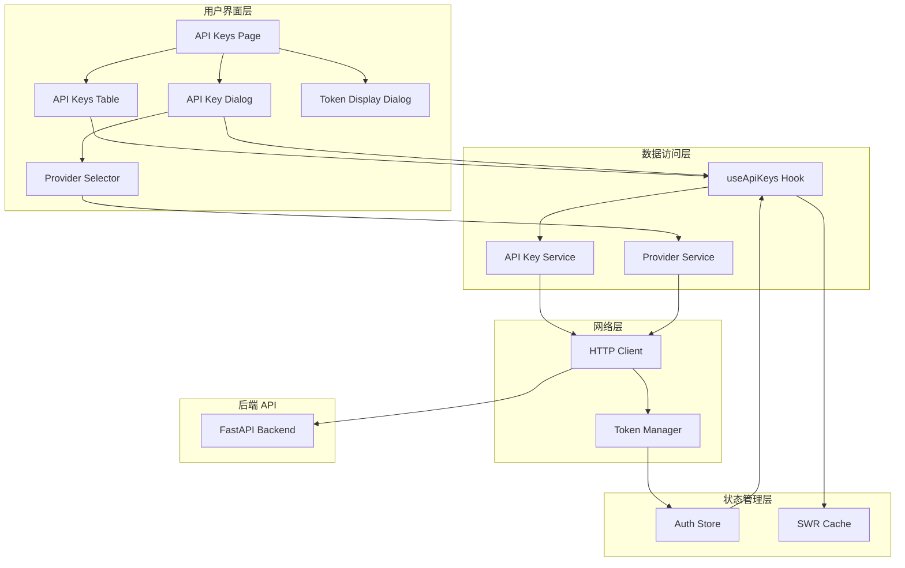
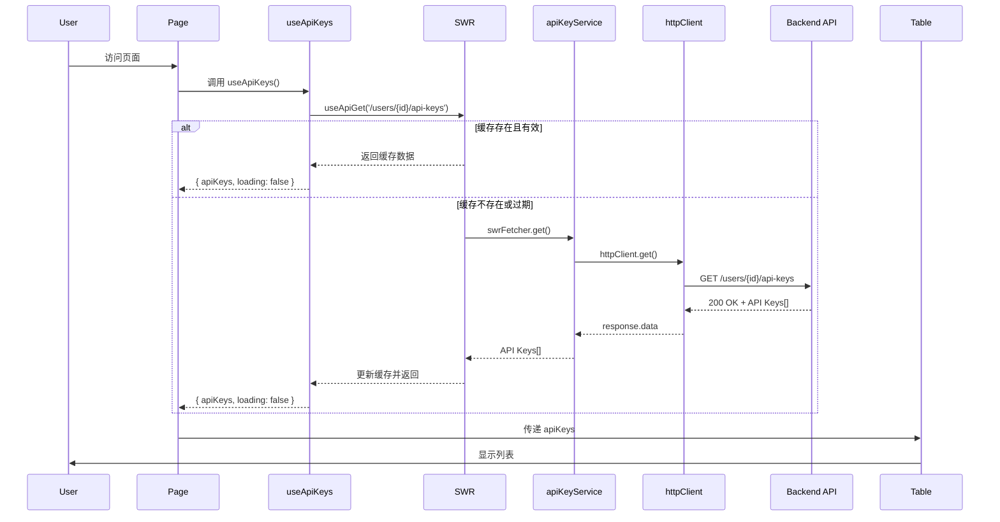
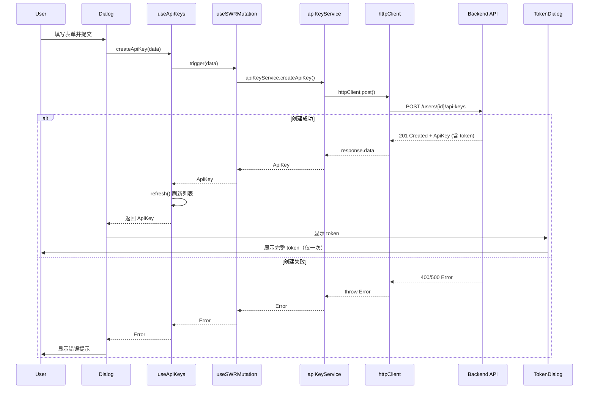

# API Keys 前端架构设计

## 系统架构图



## 数据流设计

### 1. 获取 API Keys 列表



### 2. 创建 API Key



## 组件层次结构

```
app/dashboard/api-keys/page.tsx (主页面)
├── components/dashboard/api-keys/api-keys-table.tsx (表格组件)
│   ├── @/components/ui/table (shadcn Table)
│   ├── @/components/ui/button (操作按钮)
│   └── @/components/ui/badge (状态标签)
│
├── components/dashboard/api-keys/api-key-dialog.tsx (创建/编辑对话框)
│   ├── @/components/ui/dialog (shadcn Dialog)
│   ├── @/components/ui/input (表单输入)
│   ├── @/components/ui/select (过期时间选择)
│   └── components/dashboard/api-keys/provider-selector.tsx (提供商选择)
│       └── @/components/ui/select (多选下拉框)
│
└── components/dashboard/api-keys/token-display-dialog.tsx (Token 显示对话框)
    ├── @/components/ui/dialog (shadcn Dialog)
    ├── @/components/ui/button (复制按钮)
    └── @/components/ui/alert (安全提示)
```

## 状态管理策略

### 1. 全局状态（Zustand）
- Auth Store: 用户认证信息
- 包含 user, isAuthenticated 等字段

### 2. 服务端状态（SWR）
- API Keys 列表: 自动缓存和重新验证
- Providers 列表: 静态数据，长时间缓存
- 配置选项: revalidateOnFocus, dedupingInterval 等

### 3. 本地 UI 状态（React State）
- 对话框开关状态
- 表单输入状态
- Token 显示状态
- 选中项状态

## 错误处理策略

### 1. HTTP 层错误处理
- 401: 自动刷新 token 或跳转登录
- 403: 显示权限错误
- 404: 显示资源不存在
- 500: 显示服务器错误

### 2. 业务层错误处理
- try-catch 捕获异常
- toast 显示错误信息
- 错误日志记录

### 3. UI 层错误显示
- 表单验证错误提示
- API 错误 Alert 组件
- 加载失败状态

## 性能优化策略

### 1. SWR 缓存策略
- 频繁访问的数据: 短缓存 (2秒)
- 静态数据: 长缓存 (60秒)
- 实时数据: 无缓存

### 2. 组件懒加载
- 大型对话框组件使用 dynamic import
- 显示 loading skeleton

### 3. 列表虚拟化
- 如果 API Keys 数量很大，使用虚拟滚动
- 使用 @tanstack/react-virtual

### 4. 防抖和节流
- 搜索输入防抖 (300ms)
- 按钮点击节流

## 安全考虑

### 1. Token 安全
- 完整 token 仅在创建时返回一次
- 后续只显示 key_prefix
- 不在日志中记录完整 token
- 复制后清除剪贴板（可选）

### 2. 权限控制
- 用户只能管理自己的 API Keys
- 超级用户可以管理所有用户的 Keys
- 前端验证 + 后端验证

### 3. 输入验证
- 表单字段验证（必填、格式等）
- 提供商 ID 验证
- XSS 防护（React 自动转义）

## 可访问性设计

### 1. 键盘导航
- Tab 键切换焦点
- Enter 键提交表单
- Escape 键关闭对话框

### 2. 屏幕阅读器
- 适当的 ARIA 标签
- 语义化 HTML
- 状态变化通知

### 3. 视觉设计
- 足够的颜色对比度
- 清晰的焦点指示器
- 响应式布局

## 测试策略

### 1. 单元测试
- 测试 useApiKeys hook
- 测试表单验证逻辑
- 测试工具函数

### 2. 集成测试
- 测试完整的创建流程
- 测试编辑和删除流程
- 测试错误处理

### 3. E2E 测试
- 使用 Playwright 测试完整用户流程
- 测试登录到创建 API Key 的完整流程
- 测试各种边界情况

## 部署考虑

### 1. 环境变量
- NEXT_PUBLIC_API_BASE_URL: API 基础 URL

### 2. 构建优化
- 代码分割
- Tree shaking
- 压缩和混淆

### 3. 监控和日志
- 错误追踪（Sentry）
- 性能监控（Web Vitals）
- 用户行为分析

## 未来扩展

### 1. 高级功能
- API Key 使用统计
- 速率限制配置
- IP 白名单
- Webhook 配置

### 2. 批量操作
- 批量创建
- 批量删除
- 批量更新

### 3. 导出功能
- 导出为 CSV
- 导出为 JSON
- 打印友好视图