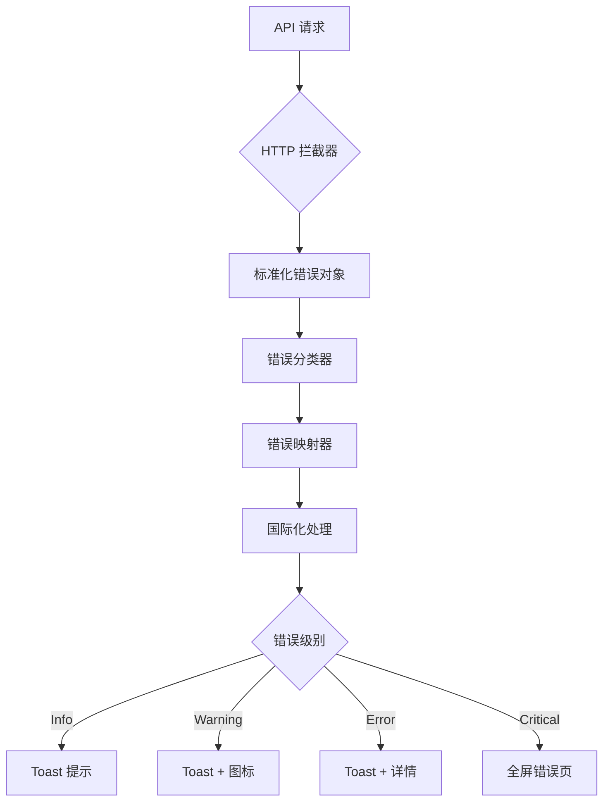

# 前端错误处理优化方案

## 一、当前问题分析

### 1.1 主要问题

根据截图和代码分析，当前错误处理存在以下问题：

1. **直接显示技术性错误信息**
   - 示例：`"加载提供商失败: Request failed with status code 405"`
   - 用户看到的是 HTTP 状态码和英文技术术语，不友好

2. **错误处理不统一**
   - 有些地方使用 `error.response?.data?.detail`
   - 有些地方使用 `error.message`
   - 有些地方硬编码错误文案
   - 缺乏统一的错误处理逻辑

3. **缺少错误分类和上下文**
   - 所有错误都用相同的 toast 提示
   - 没有区分错误严重程度（警告、错误、致命错误）
   - 缺少针对性的用户指引

4. **国际化支持不完整**
   - 部分错误信息硬编码中文
   - 错误码没有对应的 i18n key

### 1.2 代码层面问题

**前端 (`frontend/http/client.ts`)**
```typescript
// 问题1: 在拦截器中直接 showError，与业务层错误处理重复
case 403:
  showError('无权限访问该资源');  // 硬编码中文
  break;

// 问题2: 错误信息不够具体
default:
  if (status !== 401) {
    showError(errorData?.detail || '请求失败');  // 太泛化
  }
```

**业务组件中**
```typescript
// 问题3: 每个组件都要写类似的错误处理逻辑
catch (error: any) {
  const message = error.response?.data?.detail || error.message || "删除失败";
  toast.error(message);
}
```

**后端 (`backend/app/errors.py`)**
```python
# 问题4: 后端已有标准化错误格式，但前端没有充分利用
class ErrorResponse(BaseModel):
    error: str  # 机器可读的错误类型
    message: str  # 人类可读的错误消息
    code: int  # HTTP 状态码
    details: dict[str, Any] | None  # 可选的结构化错误详情
```

---

## 二、优化方案设计

### 2.1 整体架构



### 2.2 核心组件设计

#### 2.2.1 错误类型定义

```typescript
// frontend/lib/errors/types.ts

export enum ErrorSeverity {
  INFO = 'info',
  WARNING = 'warning',
  ERROR = 'error',
  CRITICAL = 'critical'
}

export enum ErrorCategory {
  NETWORK = 'network',
  AUTH = 'auth',
  PERMISSION = 'permission',
  VALIDATION = 'validation',
  BUSINESS = 'business',
  SERVER = 'server',
  UNKNOWN = 'unknown'
}

export interface StandardError {
  // 后端返回的标准字段
  error: string;           // 错误类型标识 (如 "not_found", "forbidden")
  message: string;         // 原始错误消息
  code: number;           // HTTP 状态码
  details?: Record<string, any>;  // 额外详情
  
  // 前端增强字段
  category: ErrorCategory;
  severity: ErrorSeverity;
  i18nKey?: string;       // 国际化 key
  userMessage?: string;   // 用户友好消息
  actionable?: boolean;   // 是否可操作
  retryable?: boolean;    // 是否可重试
}
```

#### 2.2.2 错误映射配置

```typescript
// frontend/lib/errors/error-map.ts

export const ERROR_MAP: Record<string, Partial<StandardError>> = {
  // 网络错误
  'network_error': {
    category: ErrorCategory.NETWORK,
    severity: ErrorSeverity.ERROR,
    i18nKey: 'errors.network_error',
    retryable: true
  },
  'timeout': {
    category: ErrorCategory.NETWORK,
    severity: ErrorSeverity.WARNING,
    i18nKey: 'errors.timeout',
    retryable: true
  },
  
  // 认证错误
  'unauthorized': {
    category: ErrorCategory.AUTH,
    severity: ErrorSeverity.ERROR,
    i18nKey: 'errors.unauthorized',
    actionable: true
  },
  'token_expired': {
    category: ErrorCategory.AUTH,
    severity: ErrorSeverity.WARNING,
    i18nKey: 'errors.token_expired',
    actionable: true
  },
  
  // 权限错误
  'forbidden': {
    category: ErrorCategory.PERMISSION,
    severity: ErrorSeverity.ERROR,
    i18nKey: 'errors.forbidden',
    actionable: false
  },
  
  // 验证错误
  'validation_error': {
    category: ErrorCategory.VALIDATION,
    severity: ErrorSeverity.WARNING,
    i18nKey: 'errors.validation_error',
    actionable: true
  },
  'bad_request': {
    category: ErrorCategory.VALIDATION,
    severity: ErrorSeverity.WARNING,
    i18nKey: 'errors.bad_request',
    actionable: true
  },
  
  // 业务错误
  'not_found': {
    category: ErrorCategory.BUSINESS,
    severity: ErrorSeverity.WARNING,
    i18nKey: 'errors.not_found',
    retryable: false
  },
  'quota_exceeded': {
    category: ErrorCategory.BUSINESS,
    severity: ErrorSeverity.ERROR,
    i18nKey: 'errors.quota_exceeded',
    actionable: true
  },
  
  // 服务器错误
  'internal_server_error': {
    category: ErrorCategory.SERVER,
    severity: ErrorSeverity.CRITICAL,
    i18nKey: 'errors.server_error',
    retryable: true
  },
  'service_unavailable': {
    category: ErrorCategory.SERVER,
    severity: ErrorSeverity.CRITICAL,
    i18nKey: 'errors.service_unavailable',
    retryable: true
  }
};

// HTTP 状态码映射
export const STATUS_CODE_MAP: Record<number, string> = {
  400: 'bad_request',
  401: 'unauthorized',
  403: 'forbidden',
  404: 'not_found',
  405: 'method_not_allowed',
  408: 'timeout',
  409: 'conflict',
  422: 'validation_error',
  429: 'rate_limit_exceeded',
  500: 'internal_server_error',
  502: 'bad_gateway',
  503: 'service_unavailable',
  504: 'gateway_timeout'
};
```

#### 2.2.3 错误处理工具类

```typescript
// frontend/lib/errors/error-handler.ts

import { AxiosError } from 'axios';
import { StandardError, ErrorCategory, ErrorSeverity } from './types';
import { ERROR_MAP, STATUS_CODE_MAP } from './error-map';

export class ErrorHandler {
  /**
   * 将 Axios 错误转换为标准错误对象
   */
  static normalize(error: unknown): StandardError {
    // 已经是标准错误
    if (this.isStandardError(error)) {
      return error as StandardError;
    }

    // Axios 错误
    if (this.isAxiosError(error)) {
      return this.fromAxiosError(error);
    }

    // 普通 Error 对象
    if (error instanceof Error) {
      return this.fromError(error);
    }

    // 未知错误
    return this.fromUnknown(error);
  }

  /**
   * 从 Axios 错误创建标准错误
   */
  private static fromAxiosError(error: AxiosError): StandardError {
    const response = error.response;
    const data = response?.data as any;

    // 后端返回的标准错误格式
    if (data?.error && data?.message && data?.code) {
      const errorType = data.error;
      const mapping = ERROR_MAP[errorType] || {};
      
      return {
        error: errorType,
        message: data.message,
        code: data.code,
        details: data.details,
        category: mapping.category || ErrorCategory.UNKNOWN,
        severity: mapping.severity || ErrorSeverity.ERROR,
        i18nKey: mapping.i18nKey,
        retryable: mapping.retryable,
        actionable: mapping.actionable
      };
    }

    // 根据状态码推断错误类型
    const statusCode = response?.status || 0;
    const errorType = STATUS_CODE_MAP[statusCode] || 'unknown_error';
    const mapping = ERROR_MAP[errorType] || {};

    return {
      error: errorType,
      message: data?.detail || error.message || '请求失败',
      code: statusCode,
      details: data,
      category: mapping.category || this.categorizeByStatus(statusCode),
      severity: mapping.severity || this.severityByStatus(statusCode),
      i18nKey: mapping.i18nKey,
      retryable: mapping.retryable,
      actionable: mapping.actionable
    };
  }

  /**
   * 从普通 Error 创建标准错误
   */
  private static fromError(error: Error): StandardError {
    return {
      error: 'client_error',
      message: error.message,
      code: 0,
      category: ErrorCategory.UNKNOWN,
      severity: ErrorSeverity.ERROR,
      i18nKey: 'errors.client_error'
    };
  }

  /**
   * 从未知错误创建标准错误
   */
  private static fromUnknown(error: unknown): StandardError {
    return {
      error: 'unknown_error',
      message: String(error),
      code: 0,
      category: ErrorCategory.UNKNOWN,
      severity: ErrorSeverity.ERROR,
      i18nKey: 'errors.unknown_error'
    };
  }

  /**
   * 根据状态码分类错误
   */
  private static categorizeByStatus(status: number): ErrorCategory {
    if (status === 401) return ErrorCategory.AUTH;
    if (status === 403) return ErrorCategory.PERMISSION;
    if (status >= 400 && status < 500) return ErrorCategory.VALIDATION;
    if (status >= 500) return ErrorCategory.SERVER;
    return ErrorCategory.UNKNOWN;
  }

  /**
   * 根据状态码确定严重程度
   */
  private static severityByStatus(status: number): ErrorSeverity {
    if (status >= 500) return ErrorSeverity.CRITICAL;
    if (status === 401 || status === 403) return ErrorSeverity.ERROR;
    if (status >= 400 && status < 500) return ErrorSeverity.WARNING;
    return ErrorSeverity.INFO;
  }

  /**
   * 类型守卫
   */
  private static isStandardError(error: unknown): boolean {
    return (
      typeof error === 'object' &&
      error !== null &&
      'error' in error &&
      'message' in error &&
      'code' in error
    );
  }

  private static isAxiosError(error: unknown): error is AxiosError {
    return (
      typeof error === 'object' &&
      error !== null &&
      'isAxiosError' in error &&
      (error as any).isAxiosError === true
    );
  }

  /**
   * 获取用户友好的错误消息
   */
  static getUserMessage(error: StandardError, t: (key: string) => string): string {
    // 优先使用国际化消息
    if (error.i18nKey) {
      const translated = t(error.i18nKey);
      if (translated !== error.i18nKey) {
        return translated;
      }
    }

    // 使用预设的用户消息
    if (error.userMessage) {
      return error.userMessage;
    }

    // 根据错误类别返回通用消息
    switch (error.category) {
      case ErrorCategory.NETWORK:
        return t('errors.network_generic');
      case ErrorCategory.AUTH:
        return t('errors.auth_generic');
      case ErrorCategory.PERMISSION:
        return t('errors.permission_generic');
      case ErrorCategory.VALIDATION:
        return t('errors.validation_generic');
      case ErrorCategory.SERVER:
        return t('errors.server_generic');
      default:
        return t('errors.generic');
    }
  }
}
```

#### 2.2.4 错误展示组件

```typescript
// frontend/lib/errors/error-display.tsx

import { toast } from 'sonner';
import { AlertCircle, AlertTriangle, Info, XCircle } from 'lucide-react';
import { StandardError, ErrorSeverity } from './types';
import { ErrorHandler } from './error-handler';
import { useI18n } from '@/lib/i18n-context';

export function useErrorDisplay() {
  const { t } = useI18n();

  const showError = (error: unknown, context?: string) => {
    const standardError = ErrorHandler.normalize(error);
    const message = ErrorHandler.getUserMessage(standardError, t);
    
    // 添加上下文信息
    const fullMessage = context 
      ? `${context}: ${message}`
      : message;

    // 根据严重程度选择展示方式
    switch (standardError.severity) {
      case ErrorSeverity.INFO:
        toast.info(fullMessage, {
          icon: <Info className="h-4 w-4" />,
          duration: 3000
        });
        break;

      case ErrorSeverity.WARNING:
        toast.warning(fullMessage, {
          icon: <AlertTriangle className="h-4 w-4" />,
          duration: 4000,
          action: standardError.retryable ? {
            label: t('common.retry'),
            onClick: () => {
              // 触发重试逻辑
            }
          } : undefined
        });
        break;

      case ErrorSeverity.ERROR:
        toast.error(fullMessage, {
          icon: <XCircle className="h-4 w-4" />,
          duration: 5000,
          description: standardError.details?.hint 
            ? t(standardError.details.hint)
            : undefined
        });
        break;

      case ErrorSeverity.CRITICAL:
        toast.error(fullMessage, {
          icon: <AlertCircle className="h-4 w-4" />,
          duration: Infinity,
          description: t('errors.critical_description'),
          action: {
            label: t('common.contact_support'),
            onClick: () => {
              // 跳转到支持页面
            }
          }
        });
        break;
    }

    // 开发环境下打印详细错误
    if (process.env.NODE_ENV === 'development') {
      console.error('[Error Details]', standardError);
    }
  };

  return { showError };
}
```

#### 2.2.5 国际化文案

```typescript
// frontend/lib/i18n/errors.ts

export const errorsTranslations = {
  en: {
    // 通用错误
    "errors.generic": "An error occurred",
    "errors.unknown_error": "Unknown error occurred",
    "errors.client_error": "Client error occurred",
    
    // 网络错误
    "errors.network_generic": "Network connection failed",
    "errors.network_error": "Unable to connect to server. Please check your network connection.",
    "errors.timeout": "Request timeout. Please try again.",
    
    // 认证错误
    "errors.auth_generic": "Authentication failed",
    "errors.unauthorized": "Please log in to continue",
    "errors.token_expired": "Your session has expired. Please log in again.",
    
    // 权限错误
    "errors.permission_generic": "Permission denied",
    "errors.forbidden": "You don't have permission to perform this action",
    
    // 验证错误
    "errors.validation_generic": "Invalid input",
    "errors.validation_error": "Please check your input and try again",
    "errors.bad_request": "Invalid request. Please check your input.",
    
    // 业务错误
    "errors.not_found": "The requested resource was not found",
    "errors.quota_exceeded": "You have exceeded your quota limit",
    "errors.method_not_allowed": "This operation is not allowed",
    "errors.conflict": "A conflict occurred. The resource may have been modified.",
    "errors.rate_limit_exceeded": "Too many requests. Please try again later.",
    
    // 服务器错误
    "errors.server_generic": "Server error occurred",
    "errors.server_error": "Server encountered an error. Please try again later.",
    "errors.service_unavailable": "Service is temporarily unavailable. Please try again later.",
    "errors.bad_gateway": "Gateway error. Please try again later.",
    "errors.gateway_timeout": "Gateway timeout. Please try again later.",
    
    // 错误详情
    "errors.critical_description": "A critical error occurred. If this persists, please contact support.",
    
    // 操作
    "common.retry": "Retry",
    "common.contact_support": "Contact Support",
  },
  zh: {
    // 通用错误
    "errors.generic": "发生错误",
    "errors.unknown_error": "发生未知错误",
    "errors.client_error": "客户端错误",
    
    // 网络错误
    "errors.network_generic": "网络连接失败",
    "errors.network_error": "无法连接到服务器，请检查网络连接",
    "errors.timeout": "请求超时，请重试",
    
    // 认证错误
    "errors.auth_generic": "认证失败",
    "errors.unauthorized": "请登录后继续",
    "errors.token_expired": "会话已过期，请重新登录",
    
    // 权限错误
    "errors.permission_generic": "权限不足",
    "errors.forbidden": "您没有权限执行此操作",
    
    // 验证错误
    "errors.validation_generic": "输入无效",
    "errors.validation_error": "请检查输入内容后重试",
    "errors.bad_request": "请求无效，请检查输入内容",
    
    // 业务错误
    "errors.not_found": "请求的资源不存在",
    "errors.quota_exceeded": "您已超出配额限制",
    "errors.method_not_allowed": "不允许此操作",
    "errors.conflict": "发生冲突，资源可能已被修改",
    "errors.rate_limit_exceeded": "请求过于频繁，请稍后再试",
    
    // 服务器错误
    "errors.server_generic": "服务器错误",
    "errors.server_error": "服务器遇到错误，请稍后重试",
    "errors.service_unavailable": "服务暂时不可用，请稍后重试",
    "errors.bad_gateway": "网关错误，请稍后重试",
    "errors.gateway_timeout": "网关超时，请稍后重试",
    
    // 错误详情
    "errors.critical_description": "发生严重错误，如果问题持续存在，请联系技术支持",
    
    // 操作
    "common.retry": "重试",
    "common.contact_support": "联系技术支持",
  }
};
```

### 2.3 HTTP 拦截器优化

```typescript
// frontend/http/client.ts (优化后)

import { ErrorHandler } from '@/lib/errors/error-handler';

// 响应拦截器 - 只做错误标准化，不直接显示
instance.interceptors.response.use(
  (response: AxiosResponse) => {
    return response;
  },
  async (error: AxiosError) => {
    const originalRequest = error.config as InternalAxiosRequestConfig & { _retry?: boolean };

    // 401 错误的 token 刷新逻辑保持不变
    if (error.response?.status === 401) {
      // ... 现有的 token 刷新逻辑 ...
    }

    // 将错误标准化后再抛出，让业务层决定如何展示
    const standardError = ErrorHandler.normalize(error);
    
    // 开发环境打印
    if (process.env.NODE_ENV === 'development') {
      console.error('[HTTP Error]', standardError);
    }

    return Promise.reject(standardError);
  }
);
```

### 2.4 业务层使用示例

```typescript
// 组件中使用

import { useErrorDisplay } from '@/lib/errors/error-display';

function MyComponent() {
  const { showError } = useErrorDisplay();
  const { t } = useI18n();

  const handleDelete = async (id: string) => {
    try {
      await deleteProvider(id);
      toast.success(t('providers.delete_success'));
    } catch (error) {
      // 统一的错误处理，自动国际化和分级
      showError(error, t('providers.delete_context'));
    }
  };

  return (
    // ... UI ...
  );
}
```

---

## 三、实施计划

### 3.1 第一阶段：基础设施（1-2天）

- [ ] 创建错误类型定义 (`frontend/lib/errors/types.ts`)
- [ ] 创建错误映射配置 (`frontend/lib/errors/error-map.ts`)
- [ ] 实现错误处理工具类 (`frontend/lib/errors/error-handler.ts`)
- [ ] 添加错误相关国际化文案 (`frontend/lib/i18n/errors.ts`)
- [ ] 更新 i18n 主文件导入错误翻译

### 3.2 第二阶段：展示层（1天）

- [ ] 实现错误展示 Hook (`frontend/lib/errors/error-display.tsx`)
- [ ] 优化 HTTP 拦截器，移除直接 toast 逻辑
- [ ] 创建错误展示组件（可选，用于复杂场景）

### 3.3 第三阶段：业务层迁移（2-3天）

按模块逐步迁移现有错误处理：

- [ ] Providers 模块
- [ ] API Keys 模块
- [ ] Credits 模块
- [ ] Submissions 模块
- [ ] System 模块（Users, Roles, Permissions）
- [ ] Routing 模块
- [ ] Auth 模块

### 3.4 第四阶段：后端对齐（1天）

- [ ] 审查后端错误响应格式
- [ ] 确保所有 API 返回标准 ErrorResponse
- [ ] 补充缺失的错误类型定义
- [ ] 更新 API 文档

### 3.5 第五阶段：测试和优化（1-2天）

- [ ] 单元测试错误处理逻辑
- [ ] 集成测试各种错误场景
- [ ] 用户体验测试
- [ ] 性能优化
- [ ] 文档更新

---

## 四、后端改进建议

### 4.1 统一错误响应格式

确保所有 API 端点都返回标准的 `ErrorResponse` 格式：

```python
# backend/app/errors.py (已有，需确保全局使用)

class ErrorResponse(BaseModel):
    error: str  # 如 "quota_exceeded", "provider_not_found"
    message: str  # 用户可读消息
    code: int  # HTTP 状态码
    details: dict[str, Any] | None = None  # 额外信息
```

### 4.2 补充错误类型

```python
# backend/app/errors.py (建议补充)

def quota_exceeded(message: str, *, details: dict[str, Any] | None = None) -> HTTPException:
    return http_error(
        status.HTTP_403_FORBIDDEN,
        error="quota_exceeded",
        message=message,
        details=details,
    )

def method_not_allowed(message: str, *, details: dict[str, Any] | None = None) -> HTTPException:
    return http_error(
        status.HTTP_405_METHOD_NOT_ALLOWED,
        error="method_not_allowed",
        message=message,
        details=details,
    )

def conflict(message: str, *, details: dict[str, Any] | None = None) -> HTTPException:
    return http_error(
        status.HTTP_409_CONFLICT,
        error="conflict",
        message=message,
        details=details,
    )

def rate_limit_exceeded(message: str, *, details: dict[str, Any] | None = None) -> HTTPException:
    return http_error(
        status.HTTP_429_TOO_MANY_REQUESTS,
        error="rate_limit_exceeded",
        message=message,
        details=details,
    )
```

### 4.3 错误详情增强

在 `details` 字段中提供更多上下文：

```python
# 示例：配额超限错误
raise quota_exceeded(
    "Provider quota exceeded",
    details={
        "current": 10,
        "limit": 10,
        "hint": "errors.quota_hint"  # 前端可用的 i18n key
    }
)

# 示例：验证错误
raise bad_request(
    "Invalid provider configuration",
    details={
        "field": "base_url",
        "reason": "invalid_url_format",
        "hint": "errors.invalid_url_hint"
    }
)
```

---

## 五、预期效果

### 5.1 用户体验改善

**改善前：**
```
❌ 加载提供商失败: Request failed with status code 405
```

**改善后：**
```
⚠️ 不允许此操作
💡 提示：此功能可能需要管理员权限
```

### 5.2 开发体验改善

**改善前：**
```typescript
catch (error: any) {
  const message = error.response?.data?.detail || error.message || "操作失败";
  toast.error(message);
}
```

**改善后：**
```typescript
catch (error) {
  showError(error, t('context.operation'));
}
```

### 5.3 可维护性提升

- ✅ 统一的错误处理逻辑
- ✅ 完整的国际化支持
- ✅ 类型安全的错误对象
- ✅ 易于扩展的错误分类
- ✅ 清晰的错误严重程度
- ✅ 开发环境详细日志

---

## 六、注意事项

1. **向后兼容**：逐步迁移，不影响现有功能
2. **性能考虑**：错误处理不应影响正常流程性能
3. **安全性**：不在前端暴露敏感的服务器错误信息
4. **可测试性**：错误处理逻辑应易于单元测试
5. **文档同步**：更新 API 文档和前端开发指南

---

## 七、参考资料

- [FastAPI 错误处理最佳实践](https://fastapi.tiangolo.com/tutorial/handling-errors/)
- [Axios 错误处理](https://axios-http.com/docs/handling_errors)
- [Sonner Toast 文档](https://sonner.emilkowal.ski/)
- [HTTP 状态码规范](https://developer.mozilla.org/en-US/docs/Web/HTTP/Status)