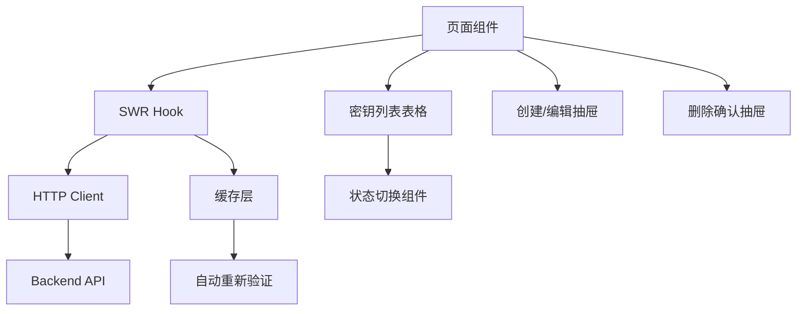

# 厂商密钥管理页面设计方案

## 1. 概述

本文档详细描述厂商 API 密钥管理功能的前端设计方案，包括页面架构、组件拆分、性能优化和国际化支持。

**页面路径**: `/dashboard/providers/[providerId]/keys`

**功能定位**: 为超级管理员提供管理指定提供商的 API 密钥的完整功能，包括查看、创建、编辑、删除和状态切换。

---

## 2. 整体架构设计

### 2.1 页面结构

```
/dashboard/providers/[providerId]/keys
├── 页面容器 (page.tsx)
├── 密钥列表表格 (provider-keys-table.tsx)
├── 创建/编辑密钥抽屉 (provider-key-dialog.tsx)
├── 删除确认抽屉 (delete-key-dialog.tsx)
└── 密钥状态切换组件 (key-status-toggle.tsx)
```

### 2.2 数据流设计



### 2.3 技术栈

- **状态管理**: SWR (数据获取和缓存)
- **UI 组件**: shadcn/ui (Table, Drawer, Badge, Switch, Button, Input, Label, Select)
- **表单验证**: React Hook Form + Zod
- **国际化**: 自定义 i18n Context
- **样式**: Tailwind CSS (水墨风格)

---

## 3. 组件拆分设计

### 3.1 页面主组件

**文件**: `frontend/app/dashboard/providers/[providerId]/keys/page.tsx`

**职责**:
- 路由参数获取 (providerId)
- 数据获取协调 (使用 SWR)
- 子组件状态管理
- 权限检查 (仅超级管理员)

**关键代码结构**:
```typescript
export default function ProviderKeysPage({ 
  params 
}: { 
  params: { providerId: string } 
}) {
  const { t } = useI18n();
  const { user } = useAuth();
  const { keys, isLoading, error, mutate } = useProviderKeys(params.providerId);
  const [dialogOpen, setDialogOpen] = useState(false);
  const [editingKey, setEditingKey] = useState<ProviderKey | null>(null);
  
  // 权限检查
  if (!user?.is_superuser) {
    return <UnauthorizedPage />;
  }
  
  return (
    <div className="container mx-auto py-8 space-y-6">
      {/* 页面头部 */}
      <PageHeader />
      
      {/* 密钥列表表格 */}
      <ProviderKeysTable 
        keys={keys}
        loading={isLoading}
        onEdit={handleEdit}
        onDelete={handleDelete}
        onToggleStatus={handleToggleStatus}
      />
      
      {/* 创建/编辑抽屉 */}
      <ProviderKeyDialog 
        open={dialogOpen}
        onOpenChange={setDialogOpen}
        editingKey={editingKey}
        providerId={params.providerId}
        onSuccess={handleSuccess}
      />
    </div>
  );
}
```

---

### 3.2 密钥列表表格组件

**文件**: `frontend/components/dashboard/provider-keys/provider-keys-table.tsx`

**职责**:
- 展示密钥列表
- 提供操作按钮 (编辑、删除、状态切换)
- 处理空状态和加载状态
- 响应式布局

**Props 接口**:
```typescript
interface ProviderKeysTableProps {
  keys: ProviderKey[];
  loading: boolean;
  onEdit: (key: ProviderKey) => void;
  onDelete: (keyId: string) => void;
  onToggleStatus: (keyId: string, newStatus: 'active' | 'inactive') => void;
}
```

**关键特性**:
- 使用 `@/components/ui/table` 组件
- 密钥字段脱敏显示 (仅显示前缀)
- 状态徽章 (active/inactive)
- 操作按钮组 (编辑、删除、状态切换)
- 空状态提示

**列定义**:
| 列名 | 宽度 | 说明 |
|------|------|------|
| 标签 (Label) | 200px | 密钥的可识别标签 |
| 密钥前缀 | 150px | 脱敏显示，如 `sk-***abc` |
| 权重 (Weight) | 100px | 路由权重，数字显示 |
| QPS 限制 | 120px | 每秒请求限制 |
| 状态 (Status) | 100px | 徽章显示 + 切换开关 |
| 创建时间 | 180px | 相对时间显示 |
| 操作 | 120px | 编辑、删除按钮 |

---

### 3.3 创建/编辑密钥抽屉

**文件**: `frontend/components/dashboard/provider-keys/provider-key-dialog.tsx`

**职责**:
- 创建新密钥
- 编辑现有密钥
- 表单验证
- 提交处理

**Props 接口**:
```typescript
interface ProviderKeyDialogProps {
  open: boolean;
  onOpenChange: (open: boolean) => void;
  editingKey: ProviderKey | null;
  providerId: string;
  onSuccess: () => void;
}
```

**表单字段**:
```typescript
interface ProviderKeyFormData {
  key: string;           // API 密钥 (创建时必填，编辑时可选)
  label: string;         // 标签 (必填)
  weight: number;        // 权重 (默认 1.0)
  max_qps: number;       // QPS 限制 (可选)
  status: 'active' | 'inactive'; // 状态 (默认 active)
}
```

**验证规则** (使用 Zod):
```typescript
const providerKeySchema = z.object({
  key: z.string().min(1, "密钥不能为空").optional(),
  label: z.string().min(1, "标签不能为空").max(100, "标签不能超过100字符"),
  weight: z.number().min(0, "权重不能为负数").max(100, "权重不能超过100"),
  max_qps: z.number().min(1, "QPS必须大于0").optional(),
  status: z.enum(['active', 'inactive'])
});
```

**UI 布局**:
- 使用 `@/components/ui/drawer`
- 表单使用 `react-hook-form`
- 输入框使用 `@/components/ui/input`
- 标签使用 `@/components/ui/label`
- 状态选择使用 `@/components/ui/select`
- 提交按钮带加载状态

---

### 3.4 删除确认抽屉

**文件**: `frontend/components/dashboard/provider-keys/delete-key-dialog.tsx`

**职责**:
- 确认删除操作
- 显示警告信息
- 处理删除请求

**Props 接口**:
```typescript
interface DeleteKeyDialogProps {
  open: boolean;
  onOpenChange: (open: boolean) => void;
  keyLabel: string;
  onConfirm: () => Promise<void>;
}
```

**特性**:
- 使用 `@/components/ui/drawer`
- 显示密钥标签
- 警告文案
- 确认/取消按钮
- 删除中状态

---

### 3.5 密钥状态切换组件

**文件**: `frontend/components/dashboard/provider-keys/key-status-toggle.tsx`

**职责**:
- 快速切换密钥状态
- 乐观更新 UI
- 错误回滚

**Props 接口**:
```typescript
interface KeyStatusToggleProps {
  keyId: string;
  currentStatus: 'active' | 'inactive';
  onToggle: (keyId: string, newStatus: 'active' | 'inactive') => Promise<void>;
  disabled?: boolean;
}
```

**实现要点**:
- 使用 shadcn/ui 的 Switch 组件 (需要安装)
- 乐观更新: 立即更新 UI，失败时回滚
- 防抖处理: 避免频繁切换
- 加载状态指示

---

## 4. 数据层设计

### 4.1 API 类型定义

**文件**: `frontend/lib/api-types.ts`

```typescript
// 厂商密钥类型
export interface ProviderKey {
  id: string;
  provider_id: string;
  label: string;
  key_prefix?: string;  // 前端显示用，后端不返回完整密钥
  weight: number;
  max_qps: number | null;
  status: 'active' | 'inactive';
  created_at: string;
  updated_at: string | null;
}

// 创建密钥请求
export interface CreateProviderKeyRequest {
  key: string;
  label: string;
  weight?: number;
  max_qps?: number;
  status?: 'active' | 'inactive';
}

// 更新密钥请求
export interface UpdateProviderKeyRequest {
  key?: string;
  label?: string;
  weight?: number;
  max_qps?: number;
  status?: 'active' | 'inactive';
}
```

---

### 4.2 HTTP 客户端

**文件**: `frontend/http/provider-keys.ts`

```typescript
import { apiClient } from './index';
import type { 
  ProviderKey, 
  CreateProviderKeyRequest, 
  UpdateProviderKeyRequest 
} from '@/lib/api-types';

// 获取密钥列表
export async function getProviderKeys(providerId: string): Promise<ProviderKey[]> {
  const response = await apiClient.get(`/providers/${providerId}/keys`);
  return response.data;
}

// 获取单个密钥详情
export async function getProviderKey(
  providerId: string, 
  keyId: string
): Promise<ProviderKey> {
  const response = await apiClient.get(`/providers/${providerId}/keys/${keyId}`);
  return response.data;
}

// 创建密钥
export async function createProviderKey(
  providerId: string, 
  data: CreateProviderKeyRequest
): Promise<ProviderKey> {
  const response = await apiClient.post(`/providers/${providerId}/keys`, data);
  return response.data;
}

// 更新密钥
export async function updateProviderKey(
  providerId: string, 
  keyId: string, 
  data: UpdateProviderKeyRequest
): Promise<ProviderKey> {
  const response = await apiClient.put(
    `/providers/${providerId}/keys/${keyId}`, 
    data
  );
  return response.data;
}

// 删除密钥
export async function deleteProviderKey(
  providerId: string, 
  keyId: string
): Promise<void> {
  await apiClient.delete(`/providers/${providerId}/keys/${keyId}`);
}
```

---

### 4.3 SWR Hook

**文件**: `frontend/lib/swr/use-provider-keys.ts`

```typescript
import useSWR from 'swr';
import { getProviderKeys } from '@/http/provider-keys';
import type { ProviderKey } from '@/lib/api-types';

export function useProviderKeys(providerId: string) {
  const { data, error, isLoading, mutate } = useSWR<ProviderKey[]>(
    providerId ? `/providers/${providerId}/keys` : null,
    () => getProviderKeys(providerId),
    {
      revalidateOnFocus: false,
      revalidateOnReconnect: true,
      dedupingInterval: 5000, // 5秒内不重复请求
    }
  );

  return {
    keys: data || [],
    isLoading,
    error,
    mutate,
  };
}
```

---

## 5. 性能优化策略

### 5.1 数据获取优化

**策略**:
1. **SWR 缓存**: 利用 SWR 的自动缓存机制，避免重复请求
2. **条件请求**: 只在 providerId 存在时发起请求
3. **去重**: 5秒内的重复请求自动去重
4. **乐观更新**: 状态切换、编辑等操作使用乐观更新

**实现示例**:
```typescript
// 乐观更新示例
const handleToggleStatus = async (keyId: string, newStatus: string) => {
  // 立即更新 UI
  mutate(
    keys.map(k => k.id === keyId ? { ...k, status: newStatus } : k),
    false // 不重新验证
  );
  
  try {
    // 发送请求
    await updateProviderKey(providerId, keyId, { status: newStatus });
    // 成功后重新验证
    mutate();
  } catch (error) {
    // 失败时回滚
    mutate();
    toast.error('状态切换失败');
  }
};
```

---

### 5.2 组件渲染优化

**策略**:
1. **React.memo**: 对列表项组件使用 memo 避免不必要的重渲染
2. **useMemo**: 缓存计算结果
3. **useCallback**: 缓存回调函数
4. **虚拟滚动**: 如果密钥数量超过 100，考虑使用虚拟滚动

**实现示例**:
```typescript
// 表格行组件使用 memo
const KeyTableRow = React.memo(({ 
  keyData, 
  onEdit, 
  onDelete, 
  onToggleStatus 
}: KeyTableRowProps) => {
  // 组件实现
});

// 页面组件中使用 useCallback
const handleEdit = useCallback((key: ProviderKey) => {
  setEditingKey(key);
  setDialogOpen(true);
}, []);

const handleDelete = useCallback(async (keyId: string) => {
  // 删除逻辑
}, [providerId, mutate]);
```

---

### 5.3 代码分割

**策略**:
1. **动态导入**: 抽屉组件使用动态导入
2. **路由级分割**: 页面自动按路由分割

**实现示例**:
```typescript
// 动态导入抽屉
const ProviderKeyDialog = dynamic(
  () => import('@/components/dashboard/provider-keys/provider-key-dialog'),
  { ssr: false }
);
```

---

## 6. 国际化支持

### 6.1 翻译键设计

**文件**: `frontend/lib/i18n-context.tsx`

**新增翻译键**:
```typescript
// 英文
en: {
  // Provider Keys 页面
  "provider_keys.title": "API Keys Management",
  "provider_keys.subtitle": "Manage API keys for this provider",
  "provider_keys.add_key": "Add Key",
  "provider_keys.empty": "No API keys configured",
  "provider_keys.empty_description": "Click 'Add Key' to create your first API key",
  
  // 表格列
  "provider_keys.column_label": "Label",
  "provider_keys.column_key_prefix": "Key Prefix",
  "provider_keys.column_weight": "Weight",
  "provider_keys.column_qps": "QPS Limit",
  "provider_keys.column_status": "Status",
  "provider_keys.column_created": "Created",
  "provider_keys.column_actions": "Actions",
  
  // 状态
  "provider_keys.status_active": "Active",
  "provider_keys.status_inactive": "Inactive",
  
  // 抽屉
  "provider_keys.dialog_create_title": "Add API Key",
  "provider_keys.dialog_edit_title": "Edit API Key",
  "provider_keys.dialog_create_description": "Configure a new API key for this provider",
  "provider_keys.dialog_edit_description": "Update API key configuration",
  
  // 表单字段
  "provider_keys.form_key": "API Key",
  "provider_keys.form_key_placeholder": "Enter API key or token",
  "provider_keys.form_key_required": "API key is required",
  "provider_keys.form_label": "Label",
  "provider_keys.form_label_placeholder": "e.g., Production Key",
  "provider_keys.form_label_required": "Label is required",
  "provider_keys.form_weight": "Weight",
  "provider_keys.form_weight_description": "Routing weight (higher = more traffic)",
  "provider_keys.form_qps": "QPS Limit",
  "provider_keys.form_qps_placeholder": "e.g., 1000",
  "provider_keys.form_qps_description": "Maximum queries per second (optional)",
  "provider_keys.form_status": "Status",
  
  // 操作
  "provider_keys.action_edit": "Edit",
  "provider_keys.action_delete": "Delete",
  "provider_keys.action_toggle_status": "Toggle Status",
  
  // 删除确认
  "provider_keys.delete_dialog_title": "Delete API Key",
  "provider_keys.delete_dialog_description": "Are you sure you want to delete the key",
  "provider_keys.delete_dialog_warning": "? This action cannot be undone and may affect routing.",
  "provider_keys.delete_confirm": "Delete",
  "provider_keys.delete_cancel": "Cancel",
  
  // Toast 消息
  "provider_keys.toast_create_success": "API key created successfully",
  "provider_keys.toast_create_error": "Failed to create API key",
  "provider_keys.toast_update_success": "API key updated successfully",
  "provider_keys.toast_update_error": "Failed to update API key",
  "provider_keys.toast_delete_success": "API key deleted successfully",
  "provider_keys.toast_delete_error": "Failed to delete API key",
  "provider_keys.toast_status_success": "Status updated successfully",
  "provider_keys.toast_status_error": "Failed to update status",
}

// 中文
zh: {
  // Provider Keys 页面
  "provider_keys.title": "API 密钥管理",
  "provider_keys.subtitle": "管理该提供商的 API 密钥",
  "provider_keys.add_key": "添加密钥",
  "provider_keys.empty": "暂无 API 密钥",
  "provider_keys.empty_description": "点击「添加密钥」创建第一个 API 密钥",
  
  // 表格列
  "provider_keys.column_label": "标签",
  "provider_keys.column_key_prefix": "密钥前缀",
  "provider_keys.column_weight": "权重",
  "provider_keys.column_qps": "QPS 限制",
  "provider_keys.column_status": "状态",
  "provider_keys.column_created": "创建时间",
  "provider_keys.column_actions": "操作",
  
  // 状态
  "provider_keys.status_active": "运行中",
  "provider_keys.status_inactive": "已禁用",
  
  // 抽屉
  "provider_keys.dialog_create_title": "添加 API 密钥",
  "provider_keys.dialog_edit_title": "编辑 API 密钥",
  "provider_keys.dialog_create_description": "为该提供商配置新的 API 密钥",
  "provider_keys.dialog_edit_description": "更新 API 密钥配置",
  
  // 表单字段
  "provider_keys.form_key": "API 密钥",
  "provider_keys.form_key_placeholder": "请输入 API 密钥或令牌",
  "provider_keys.form_key_required": "API 密钥不能为空",
  "provider_keys.form_label": "标签",
  "provider_keys.form_label_placeholder": "例如：生产环境密钥",
  "provider_keys.form_label_required": "标签不能为空",
  "provider_keys.form_weight": "权重",
  "provider_keys.form_weight_description": "路由权重（越高流量越多）",
  "provider_keys.form_qps": "QPS 限制",
  "provider_keys.form_qps_placeholder": "例如：1000",
  "provider_keys.form_qps_description": "每秒最大请求数（可选）",
  "provider_keys.form_status": "状态",
  
  // 操作
  "provider_keys.action_edit": "编辑",
  "provider_keys.action_delete": "删除",
  "provider_keys.action_toggle_status": "切换状态",
  
  // 删除确认
  "provider_keys.delete_dialog_title": "删除 API 密钥",
  "provider_keys.delete_dialog_description": "确定要删除密钥",
  "provider_keys.delete_dialog_warning": "吗？此操作不可撤销，可能影响路由。",
  "provider_keys.delete_confirm": "删除",
  "provider_keys.delete_cancel": "取消",
  
  // Toast 消息
  "provider_keys.toast_create_success": "API 密钥创建成功",
  "provider_keys.toast_create_error": "创建 API 密钥失败",
  "provider_keys.toast_update_success": "API 密钥更新成功",
  "provider_keys.toast_update_error": "更新 API 密钥失败",
  "provider_keys.toast_delete_success": "API 密钥删除成功",
  "provider_keys.toast_delete_error": "删除 API 密钥失败",
  "provider_keys.toast_status_success": "状态更新成功",
  "provider_keys.toast_status_error": "状态更新失败",
}
```

---

### 6.2 使用示例

```typescript
import { useI18n } from '@/lib/i18n-context';

export function ProviderKeysPage() {
  const { t } = useI18n();
  
  return (
    <div>
      <h1>{t("provider_keys.title")}</h1>
      <p>{t("provider_keys.subtitle")}</p>
      <Button>{t("provider_keys.add_key")}</Button>
    </div>
  );
}
```

---

## 7. UI 设计规范

### 7.1 水墨风格应用

遵循项目的水墨美学设计原则:

**色彩方案**:
- 主色调: 深灰 (#1a1a1a) 和纯白 (#ffffff)
- 辅助色: 浅灰 (#f5f5f5) 和中灰 (#d0d0d0)
- 状态色:
  - Active: 深蓝 (#0066cc)
  - Inactive: 中灰 (#999999)
  - Success: #4CAF50
  - Error: #F44336

**布局原则**:
- 大量留白，元素间距至少 24px
- 卡片使用细边框或微妙阴影
- 表格行高 48px，提供呼吸空间

**交互设计**:
- 悬停效果: 轻微阴影和色值变化
- 按钮: 圆角 4px，高度 40px
- 输入框: 无边框设计，底部细线

---

### 7.2 响应式设计

**断点**:
- Mobile: < 640px
- Tablet: 640px - 1024px
- Desktop: > 1024px

**适配策略**:
- Mobile: 卡片式布局，操作按钮下拉菜单
- Tablet: 简化表格列，隐藏次要信息
- Desktop: 完整表格展示

---

## 8. 安全考虑

### 8.1 密钥显示

- **前端**: 仅显示密钥前缀 (如 `sk-***abc`)
- **后端**: 完整密钥仅在创建时返回一次
- **编辑**: 编辑时不显示完整密钥，仅可更新

### 8.2 权限控制

- 页面级: 仅超级管理员可访问
- 操作级: 所有操作需要超级管理员权限
- 错误处理: 401/403 自动跳转登录或显示无权限页面

---

## 9. 错误处理

### 9.1 错误类型

1. **网络错误**: 显示重试按钮
2. **权限错误**: 显示无权限提示
3. **验证错误**: 表单字段下方显示错误信息
4. **服务器错误**: Toast 提示 + 错误日志

### 9.2 错误边界

```typescript
// 页面级错误边界
<ErrorBoundary fallback={<ErrorPage />}>
  <ProviderKeysPage />
</ErrorBoundary>
```

---

## 10. 测试策略

### 10.1 单元测试

- 组件渲染测试
- 表单验证测试
- 工具函数测试

### 10.2 集成测试

- API 调用测试
- SWR Hook 测试
- 用户交互流程测试

### 10.3 E2E 测试

- 创建密钥流程
- 编辑密钥流程
- 删除密钥流程
- 状态切换流程

---

## 11. 实现优先级

### Phase 1: 核心功能 (高优先级)
- [x] API 类型定义
- [ ] HTTP 客户端实现
- [ ] SWR Hook 实现
- [ ] 页面主组件
- [ ] 密钥列表表格
- [ ] 创建/编辑抽屉

### Phase 2: 增强功能 (中优先级)
- [ ] 删除确认抽屉
- [ ] 状态切换组件
- [ ] 国际化翻译
- [ ] 错误处理
- [ ] 加载状态

### Phase 3: 优化功能 (低优先级)
- [ ] 性能优化
- [ ] 响应式适配
- [ ] 单元测试
- [ ] E2E 测试

---

## 12. 集成方式

### 12.1 从 Provider 列表进入

在 Provider 列表页面添加"管理密钥"按钮:

```typescript
// frontend/app/dashboard/providers/page.tsx
<Button 
  variant="outline" 
  size="sm"
  onClick={() => router.push(`/dashboard/providers/${provider.id}/keys`)}
>
  <Key className="w-4 h-4 mr-2" />
  {t("providers.action_manage_keys")}
</Button>
```

### 12.2 从 Provider 详情页进入

在 Provider 详情页添加"密钥管理"标签页:

```typescript
// frontend/app/dashboard/providers/[providerId]/page.tsx
<Tabs defaultValue="overview">
  <TabsList>
    <TabsTrigger value="overview">概览</TabsTrigger>
    <TabsTrigger value="keys">密钥管理</TabsTrigger>
    <TabsTrigger value="models">模型列表</TabsTrigger>
  </TabsList>
  
  <TabsContent value="keys">
    <ProviderKeysManagement providerId={providerId} />
  </TabsContent>
</Tabs>
```

---

## 13. 附录

### 13.1 相关文档

- [后端 API 文档](../backend/API_Documentation.md#厂商密钥管理)
- [UI 设计规范](../../ui-prompt.md)
- [积分页面设计](./credits-page-design.md)

### 13.2 参考实现

- 积分管理页面: `frontend/app/dashboard/credits/page.tsx`
- 表格组件: `frontend/components/dashboard/credits/credit-transactions-table.tsx`
- 抽屉/弹窗组件: `frontend/components/dashboard/credits/admin-topup-dialog.tsx`

---

**文档版本**: 1.0  
**最后更新**: 2025-12-05  
**作者**: AI Architect
